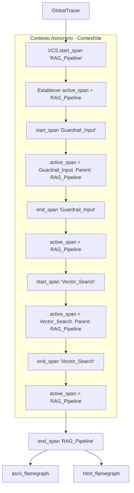

# LLM Observability Tracer

Motor de monitoreo, perfilado y telemetria de extremo a extremo (End-to-End) disenado para registrar la ejecucion de llamadas de modelos de lenguaje (LLMs), consumos de tokens, estimaciones de coste de API y latencias de procesos mediante arboles de ejecucion estructurados (Spans).

Este modulo permite inyectar observabilidad profunda en pipelines complejos (como RAG o sistemas de agentes autonomos) y exportar bitacoras detalladas e interfaces interactivas de analisis de rendimiento (Flame Graphs HTML y ASCII).

## Arquitectura de Telemetria y Pila de Spans

El sistema se estructura en torno a unidades de trabajo temporales (Spans) organizadas de forma jerarquica para rastrear cuellos de botella en la ejecucion.



### 1. Representacion Jerarquica de Spans

Un **Span** es la representacion logica de una tarea o callback (ej: busqueda vectorial, clasificacion, inferencia, etc.). Cada objeto `SpanModel` se persiste e instrumenta con las siguientes propiedades:
*   `id` y `parent_id`: Identificadores UUID que permiten reconstruir el arbol de llamadas (Grafo Dirigido).
*   `start_time` y `end_time`: Timestamps de punto flotante de alta precision para calcular la latencia:
    $$\text{Latencia} = \text{end\_time} - \text{start\_time}$$
*   `inputs` y `outputs`: Diccionarios estructurados que auditan los argumentos y respuestas del paso.
*   `metadata`: Diccionario abierto que almacena telemetria especifica como `input_tokens`, `output_tokens`, `model_name` y `cost`.

### 2. Aislamiento Asincrono mediante ContextVar

Para soportar el servido concurrente en APIs web (FastAPI/Uvicorn) o la ejecucion paralela en subprocesos sin mezclar los arboles de trazas de peticiones de distintos usuarios, el motor gestiona el estado del span activo utilizando:

```python
_active_span_var: ContextVar[Optional[SpanModel]] = ContextVar("active_span", default=None)
```

Al invocar `start_span(name)`:
1.  El tracer recupera el span activo en el hilo o corrutina actual: `parent = _active_span_var.get()`.
2.  Si existe un padre, el nuevo span se anexa como hijo de este. Si no, se registra como un Span Raiz (`root_spans`).
3.  Se actualiza el puntero de contexto local: `_active_span_var.set(new_span)`.

Al llamar a `end_span()`:
1.  Se cierra la ventana temporal del span activo actual.
2.  El puntero de contexto se revierte al parent id correspondiente: `_active_span_var.set(parent)`.

### 3. Visualizaciones Exportables (Flame Graphs)

El tracer provee dos interfaces graficas de diagnostico de latencia:
*   **Flame Graph ASCII:** Formatea en consola el arbol de Spans indentando la jerarquia, inyectando colores de exito/error, latencia en milisegundos, conteo de tokens y el coste acumulado en dolares.
*   **Visualizador Flame Graph HTML Interactivo:** Exporta una aplicacion web estática e independiente configurada bajo una estética moderna en color violeta oscuro. La aplicacion embebe la estructura de datos JSON y grafica barras interactivas de duracion relativa, habilitando paneles flotantes con detalles de inputs/outputs al hacer click sobre los bloques.

## Conexión con el Ecosistema

Este modulo actua como el inspector central de la suite:
1.  **hybrid-search-retrieval-pipeline:** Instrumenta las llamadas a BM25 y NanoVectorDB para auditar los tiempos parciales de busqueda dispersa vs densa.
2.  **llm-inference-server / semantic-model-router:** Mide el tiempo consumido en la generacion de tokens, recopila el conteo real de tokens devueltos por el backend y calcula el coste en dolares del enrutamiento.
3.  **orchestra-agents / secure-tool-runtime:** Registra la traza del bucle ReAct del agente, detallando la duracion de cada paso de pensamiento y el rendimiento del sandbox de ejecucion de herramientas.

## Estructura del Proyecto

*   `tracer.py`: Define el esquema Pydantic `SpanModel`, la variable contextual `ContextVar` y la clase `GlobalTracer` con los metodos de renderizado ASCII e HTML.
*   `test_tracer.py`: Suite de test unitarios que comprueba la jerarquia del arbol, la estabilidad del contexto asincrono asilado ante ejecuciones concurrentes, la captura de excepciones y el calculo de costes.
*   `example.py`: Script interactivo de simulacion que instrumenta un flujo RAG completo con llamadas anidadas de base de datos, rerankers y guardrails, imprimiendo el reporte en consola y generando el visualizador HTML en disco.

## Instalacion y Ejecucion

### 1. Activar el Entorno Local e Instalar Dependencias

Dado que el modulo aprovecha las librerias nativas de control de contexto de Python, las dependencias son minimas:

```bash
python3 -m venv .venv
source .venv/bin/activate
pip install -r requirements.txt
```

### 2. Ejecutar Pruebas de Telemetria

```bash
.venv/bin/python -m unittest test_tracer.py
```

### 3. Ejecutar Demostración de Monitoreo

```bash
.venv/bin/python example.py
```

El script simulara una llamada de orquestacion multi-agente RAG y generara el reporte jerarquico en consola. Asimismo, creara el archivo interactivo `observability_flamegraph.html` en el directorio de ejecucion para ser inspeccionado en el navegador web.
