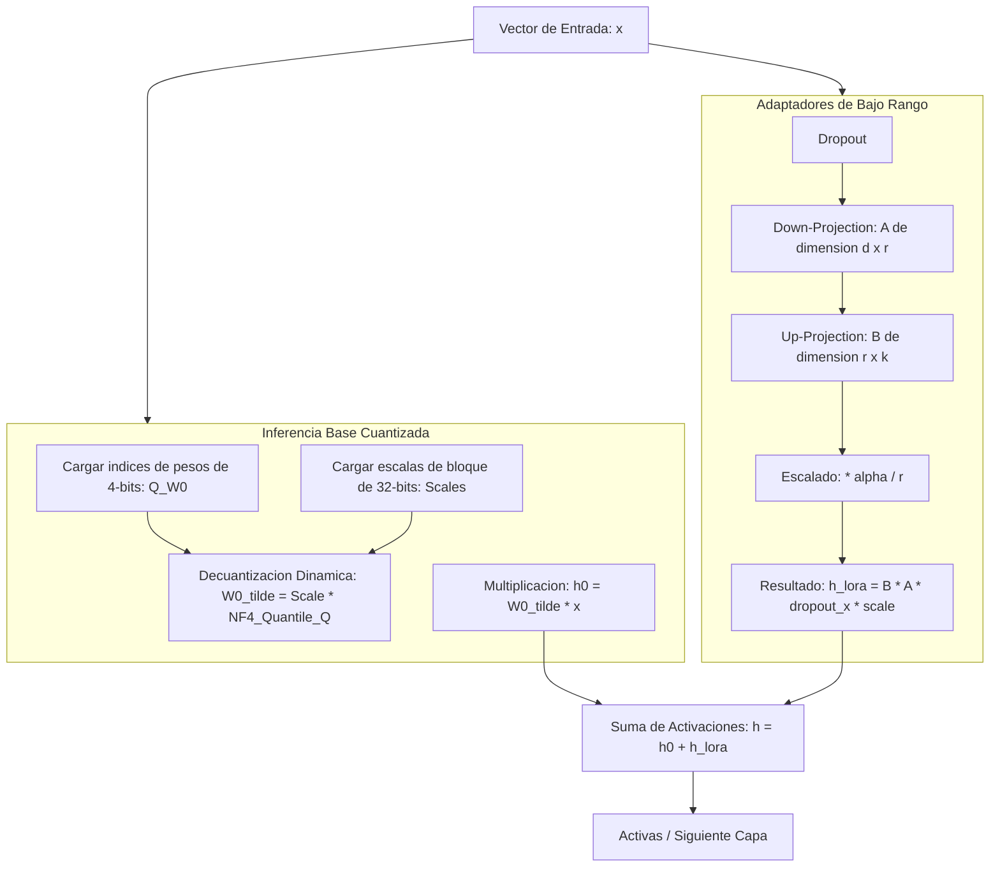

# LLM QLoRA Finetuner

Pipeline modular y eficiente de alto rendimiento para realizar el ajuste fino (fine-tuning) de modelos de lenguaje mediante Adaptacion de Bajo Rango (LoRA) y cuantizacion de 4 bits (QLoRA) en PyTorch, disenado para optimizar el consumo de memoria grafica (VRAM) en hardware de recursos limitados.

Este modulo implementa de forma nativa la inyeccion de capas adaptadoras de bajo rango y la cuantizacion bloque a bloque bajo el formato NormalFloat4 (NF4) propuesto por Tim Dettmers et al. (2023), permitiendo emular la compresion y ejecucion de modelos cuantizados sin depender de librerias binarias compiladas de CUDA de terceros.

## Fundamentos Teoricos y Arquitectura de Computo

La optimizacion de QLoRA reduce los requisitos de memoria del modelo base en aproximadamente un 75% al cuantizar sus tensores estaticos, mientras inyecta matrices entrenables de bajo rango que capturan los gradientes del ajuste fino.



### 1. Adaptacion de Bajo Rango (LoRA)

Durante el ajuste fino, en lugar de actualizar la matriz completa de parametros del modelo $W_0 \in \mathbb{R}^{d \times k}$ (lo que requiere una gran cantidad de memoria para almacenar los momentos del optimizador), LoRA congela $W_0$ y descompone la matriz de actualizacion $\Delta W$ en dos matrices de bajo rango entrenables $A$ y $B$:

$$W = W_0 + \Delta W = W_0 + \frac{\alpha}{r} (B \cdot A)$$

Donde:
*   $A \in \mathbb{R}^{r \times d}$ es la matriz de proyeccion hacia abajo (Down-Projection), inicializada mediante distribucion normal uniforme de Kaiming para permitir el flujo inicial de gradientes.
*   $B \in \mathbb{R}^{k \times r}$ es la matriz de proyeccion hacia arriba (Up-Projection), inicializada en cero absoluto para garantizar que la alteracion inicial sea nula ($\Delta W = 0$) y el modelo comience el ajuste con las mismas salidas exactas que el modelo pre-entrenado.
*   $r$ es el rango de la descomposicion ($r \ll d$).
*   $\alpha$ es un factor de escala constante que estabiliza el entrenamiento al alterar el rango, evitando reajustar los hiperparametros de optimizacion.

El paso de forward pass se define como:
$$h = W_0 x + \frac{\alpha}{r} B(A(\text{dropout}(x)))$$

### 2. Cuantizacion NormalFloat4 (NF4) Bloque a Bloque

El tipo de datos NormalFloat4 (NF4) es un esquema de cuantizacion optimizado teoricamente para pesos de redes neuronales que siguen una distribucion normal con media cero y desviacion estandar constante. El cuantizador `NF4Quantizer` divide los pesos a cuantizar en bloques estáticos:

1.  **Bloques Estaticos:** La matriz de pesos se divide en bloques de tamano $B_{\text{size}} = 64$ elementos.
2.  **Escala Absmax:** Para cada bloque $i$, se computa la escala como el valor absoluto maximo de sus pesos:
    $$s_i = \max_{j} |w_{ij}|$$
3.  **Normalizacion:** Los pesos del bloque se normalizan al rango $[-1, 1]$ mediante $w'_{ij} = \frac{w_{ij}}{s_i}$ y se mapean al indice del cuantil NF4 mas cercano de los 16 cuantiles teoricos predefinidos (guardando cada peso en un espacio de 4 bits).
4.  **Decuantizacion al Vuelo:** Durante la propagacion hacia adelante (forward pass), el motor decuantiza dinamicamente el bloque para realizar las operaciones algebraicas en punto flotante standard (`fp32` o `fp16`):
    $$\tilde{w}_{ij} = s_i \cdot \text{NF4}[Q_{\text{index}}(w'_{ij})]$$

## Conexión con el Ecosistema

Este modulo actua como el motor de entrenamiento local de la suite:
1.  **synthetic-data-generator / dataset-version-control:** Suministran y versionan los conjuntos de datos en formato JSON de Instruction Tuning y DPO para alimentar los bucles de entrenamiento de PyTorch.
2.  **llm-inference-server:** Al finalizar el entrenamiento del modulo, los adaptadores (archivos de pesos PEFT ligeros en formato JSON/PT) se exportan para ser acoplados al modelo base limpio servido por el servidor de inferencia de produccion.
3.  **llm-eval-harness:** Evalua la degradacion o ganancia de precision de los pesos resultantes de la decuantizacion NF4 y LoRA frente al modelo base de referencia.

## Estructura del Proyecto

*   `finetuner.py`: Implementa el cuantizador `NF4Quantizer` (cuantizacion y decuantizacion por bloques), la capa envolvente `LoraLinear` compatible con PyTorch Autograd y la clase orquestadora `QLoraFinetuner`.
*   `test_finetuner.py`: Suite de test unitarios que comprueba la estabilidad de los gradientes en las capas LoRA, la precision matematica de la de-cuantizacion NF4 y la importacion/exportacion de adaptadores.
*   `example.py`: Demostracion ejecutable que entrena un modelo multicapa base cuantizado en NF4 utilizando adaptadores LoRA y un optimizador AdamW sobre un dataset sintetico, mostrando la reduccion del loss y guardando los pesos del adaptador PEFT en disco.

## Instalacion y Uso

### 1. Activar el Entorno Local e Instalar Dependencias

Dado que el modulo implementa la decuantizacion bloque por bloque de forma nativa en tensores de PyTorch, no requiere de compiladores externos de CUDA:

```bash
python3 -m venv .venv
source .venv/bin/activate
pip install -r requirements.txt
```

### 2. Ejecutar la Suite de Pruebas Unitarias

Compruebe la consistencia matematica de los cuantiles de precision NF4 y la actualizacion de parametros LoRA:

```bash
.venv/bin/python -m unittest test_finetuner.py
```

### 3. Ejecutar la Demostracion de Entrenamiento

Inicie la simulacion del entrenamiento parametrico:

```bash
.venv/bin/python example.py
```

El script cuantizara un modelo lineal base a 4-bits (NF4), inyectara los adaptadores entrenables, correra un ciclo de optimizacion AdamW y finalmente guardara y volvera a cargar los adaptadores exportados para verificar la inferencia integrada.
