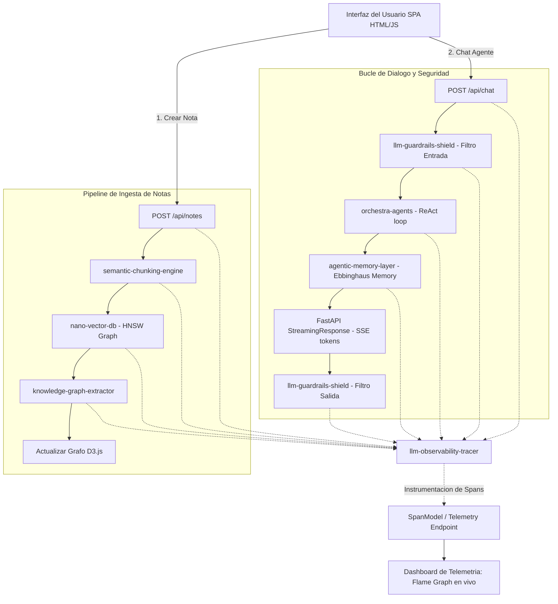

# Nexus Second Brain

El producto consolidado e integrado de la suite **ai-core-infra**. Consiste en una aplicacion web Single Page Application (SPA) responsiva disenada con una estetica premium en Dark Mode (con degradados de neon violeta, paneles de Glassmorphism y tipografia Montserrat) que unifica bajo una misma interfaz de control todas las capacidades modulares desarrolladas a lo largo de la infraestructura.

La aplicacion permite interactuar en tiempo real con indices de busqueda vectorial HNSW, visualizar grafos de conocimiento interactivos manipulados por simuladores de fuerzas fisicas, dialogar con agentes autonomos equipados con memoria de decaimiento y supervisar el rendimiento interno mediante un panel de telemetria en vivo (Flame Graph).

## Arquitectura de Consolidación e Interlinking

El modulo actua como el plano de aplicacion (Application Plane) que coordina los subproyectos del repositorio.



### 1. El Pipeline de Ingesta y Procesamiento

Al guardar una nueva nota semantica en el sistema:
1.  **Segmentacion Semantica:** El texto se divide en fragmentos cohesivos usando el `semantic-chunking-engine`, evitando rupturas artificiales de oraciones.
2.  **Registro Vectorial:** Los embeddings de los fragmentos se calculan localmente y se indexan en el grafo HNSW multicapa de `nano-vector-db`.
3.  **Mapeo de Entidades:** El modulo `knowledge-graph-extractor` analiza el texto extrayendo relaciones logicas (ejemplo: `[Nota] -> contiene -> [Concepto] -> pertenece a -> [Categoria]`) para poblar la base del grafo relacional.
4.  **Telemetria:** Cada una de estas fases se registra de manera anidada en un Span de telemetria de `llm-observability-tracer`.

### 2. El Bucle de Chat Autonomo y Seguro

Al iniciar un dialogo con el agente integrado:
1.  **Filtro de Entrada:** El prompt pasa por el escudo de `llm-guardrails-shield` para detectar inyecciones de codigo y anonimizar datos personales (PII) como correos y telefonos.
2.  **Razonamiento ReAct:** El motor `orchestra-agents` inicia un bucle de pensamientos e invocaciones a herramientas para responder a la consulta del usuario.
3.  **Memoria Episodica:** El agente consulta `agentic-memory-layer` recuperando hechos del cerebro digital aplicando decaimiento temporal (curva del olvido de Ebbinghaus) para evitar cargar el contexto de datos irrelevantes.
4.  **Emision por Streaming:** El servidor FastAPI retorna una conexion mediante Server-Sent Events (SSE) entregando los tokens palabra por palabra en tiempo real al chat del SPA.
5.  **Filtro de Salida:** Antes de renderizar la respuesta, el cortafuegos valida que no existan alucinaciones RAG flagrantes ni fugas accidentales de API Keys.

### 3. Componentes de la Interfaz Premium

*   **Mapa del Grafo en D3.js:** Visualizador interactivo que mapea los nodos del cerebro digital aplicando un simulador de fuerzas fisicas (fuerza de enlace con distancia 80, fuerza de repulsion de carga -100, fuerza de colision de radio 25). Colorea en morado el nodo raiz, en rojo las notas y en azul los conceptos teoricos, soportando arrastre de nodos, zoom y panning.
*   **Flame Graph Dashboard:** Un panel lateral que consume el endpoint `/api/telemetry` del trazador de observabilidad y dibuja graficos de barras horizontales proporcionales a la latencia real en milisegundos de cada modulo, coloreando en rojo los pasos fallidos y permitiendo hacer click en cada barra para desplegar inputs/outputs.

## Requisitos de Instalacion

El modulo requiere Python 3.9 o superior y las siguientes dependencias:

*   FastAPI
*   Uvicorn
*   SSE-Starlette
*   Pydantic
*   HTTPX (Test Client)

Para instalar las dependencias locales, active su entorno virtual y ejecute:

```bash
pip install -r requirements.txt
```

## Estructura del Proyecto

*   `main.py`: Servidor FastAPI que expone los endpoints de notas, grafos, chat SSE y telemetria, integrando las importaciones de los modulos hermanos del workspace.
*   `templates/index.html`: Codigo fuente del Single Page Application, disenado con estilos vanilla CSS (Glassmorphism, Neon Glow) y controladores JavaScript nativos para D3.js y streaming SSE.
*   `test_nexus.py`: Suite de test unitarios asincronos que validan los endpoints REST, el control de errores, la recuperacion del grafo y la consistencia de las respuestas de chat.
*   `example.py`: Script de arranque del producto que pre-pobla el cerebro digital con notas sobre RAG, QLoRA y DVC para inicializar el grafo de conocimiento, y levanta el servidor web.

## Instalacion y Ejecucion

### 1. Activar el Entorno Local e Instalar Dependencias

Asegurese de situarse en el directorio del proyecto antes de activar el entorno:

```bash
python3 -m venv .venv
source .venv/bin/activate
pip install -r requirements.txt
```

### 2. Ejecutar Pruebas de Integracion

Valide la consistencia de los endpoints y el flujo del servidor:

```bash
.venv/bin/python -m unittest test_nexus.py
```

### 3. Arrancar la Aplicación Consolidada

Inicie el bootstrap de notas y el servidor FastAPI local:

```bash
.venv/bin/python example.py
```

El script imprimira la carga inicial de datos y habilitara el servido en:
*   **URL de Acceso:** http://127.0.0.1:8000

Abra la URL en su navegador preferido para interactuar con la consola de administracion del cerebro digital, visualizar las fuerzas D3.js y supervisar el Flame Graph de observabilidad en tiempo real.
