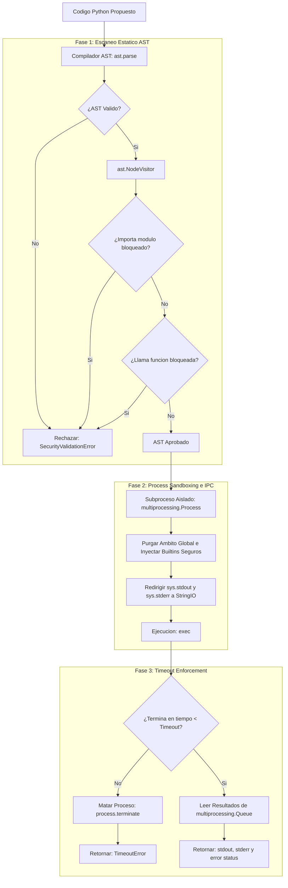

# Secure Tool Runtime

Entorno de ejecucion seguro (Sandbox) disenado para compilar y ejecutar fragmentos de codigo interpretado en Python de forma aislada y controlada. Este componente proporciona a los agentes autonomos la capacidad de procesar scripts dinámicos y evaluar formulas matematicas complejas (Tool-calling) de manera segura, neutralizando inyecciones de comandos, accesos no autorizados al sistema de archivos local, fugas de red y denegaciones de servicio (DoS) por bucles infinitos.

## Arquitectura de Seguridad Multipaso

La seguridad del motor de ejecucion se articula en tres niveles superpuestos que protegen el hilo supervisor principal del sistema operativo.



### 1. Validacion Estatica del Codigo (Analisis AST)

El filtrado ingenuo de cadenas de texto (ej. buscar subcadenas como `"import os"` u `"open"`) es facilmente evadido mediante tecnicas de obfuscacion, codificacion hexadecimal o llamadas indirectas como:
```python
getattr(sys.modules["__builtins__"], "op" + "en")("/etc/passwd")
```

Para evitar esto, `SecureToolRuntime` parsea el codigo fuente a un Arbol de Sintaxis Abstracta (AST) antes de compilarlo:
*   **Analisis Estructural:** El modulo `ASTSafetyValidator` hereda de `ast.NodeVisitor` e inspecciona la gramatica del script a nivel de compilacion.
*   **Bloqueo de Importaciones:** Intercepta nodos `ast.Import` y `ast.ImportFrom`, rechazando de forma inmediata importaciones de modulos de sistema, red o ejecucion reflexiva:
    $$\text{Banned Modules} = \{\text{os, sys, subprocess, socket, builtins, shutil, ctypes, requests, urllib, pty, platform}\}$$
*   **Bloqueo de Invocaciones:** Intercepta nodos `ast.Call` detectando llamadas directas o por atributo a funciones prohibidas de manipulacion de ambitos y archivos:
    $$\text{Banned Calls} = \{\text{eval, exec, open, compile, getattr, setattr, globals, locals, \_\_import\_\_, input, exit, quit}\}$$

### 2. Aislamiento de Ejecucion (Process Sandboxing)

Una vez aprobado por el escaner AST, el codigo es ejecutado en un proceso de sistema operativo independiente mediante `multiprocessing.Process`. Esto aisla la ejecucion de la memoria del proceso padre y protege al orquestador ante fallos de segmentacion o desbordamientos del interprete.

*   **Restriccion de Builtins:** Se redefine el diccionario de funciones integradas globales del modulo (`__builtins__`) a una lista blanca de utilidades matematicas e iteradores seguros (`abs`, `len`, `range`, `print`, `dict`, `list`, `sum`, etc.), suprimiendo cualquier acceso a cargadores de modulos o sockets.
*   **Redireccion de Stream de Salida:** Se capturan de forma aislada los flujos `sys.stdout` y `sys.stderr` volcando la salida a buffers locales de tipo `io.StringIO` para auditoria del agente.
*   **Comunicacion Interproceso (IPC):** Se utiliza una cola thread-safe `multiprocessing.Queue` para enviar una tupla con los resultados de la ejecucion, la salida capturada y la traza detallada del error de vuelta al proceso supervisor.

### 3. Limites de Recursos (Timeout Enforcement)

Para prevenir ataques de CPU o bucles infinitos no intencionados en scripts generados por agentes (por ejemplo, `while True: pass`), el proceso supervisor bloquea la ejecucion utilizando un temporizador:

```python
process.join(timeout=timeout_seconds)
```

Si transcurrido el tiempo asignado (por defecto `2.0` segundos) el subproceso continua activo, se procede a su finalizacion forzada enviando una senal `SIGTERM` mediante `process.terminate()`. Posteriormente se actualiza el estado y se retorna un error controlado de timeout.

## Conexión con el Ecosistema

Este modulo proporciona seguridad operacional en las siguientes llamadas:
1.  **orchestra-agents:** Los agentes autonomos del ecosistema registran la consola de este entorno seguro como una herramienta basica (ej: `execute_python`), permitiendo resolver problemas matematicos, analisis de cadenas de texto y simulacion logica sin comprometer la maquina host.
2.  **llm-guardrails-shield:** El cortafuegos puede desviar fragmentos de salida del LLM que se sospechen que contienen codigo ejecutable para ser parseados por el validador AST de este modulo antes de dar autorizacion de servido.

## Estructura del Proyecto

*   `runtime.py`: Contiene el validador estatico `ASTSafetyValidator`, la funcion worker de ejecucion aislada y la clase principal `SecureToolRuntime`.
*   `test_runtime.py`: Pruebas de integracion que verifican la intercepcion de `open`, `eval`, e importaciones encubiertas, el control de la salida capturada y la interrupcion por timeout ante bucles infinitos.
*   `example.py`: Script interactivo que ilustra ejecuciones exitosas de scripts seguros, bloqueos estaticos de inyecciones y la finalizacion controlada de bucles infinitos.

## Instalacion y Ejecucion

### 1. Activar el Entorno Local e Instalar Dependencias

Dado que el modulo aprovecha las librerias nativas de control de procesos del nucleo de Python, los requisitos son minimos:

```bash
python3 -m venv .venv
source .venv/bin/activate
pip install -r requirements.txt
```

### 2. Ejecutar Pruebas Automatizadas

```bash
.venv/bin/python -m unittest test_runtime.py
```

### 3. Ejecutar Demostración de Sandbox

```bash
.venv/bin/python example.py
```

El script demostrara graficamente en consola los tres pasos de proteccion, imprimiendo las alertas de seguridad generadas al intentar invocar comandos restringidos y la captura de errores en tiempo de ejecucion.
