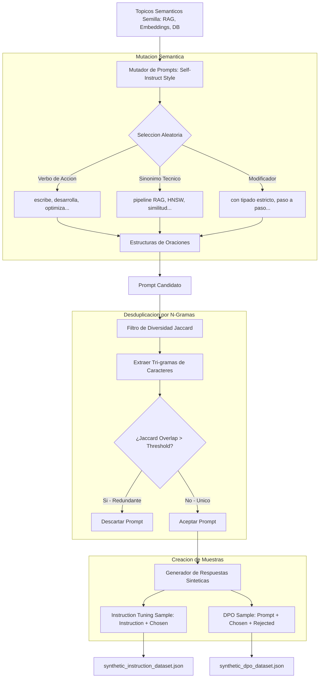

# Synthetic Data Generator

Motor automatizado para la generacion, mutacion semantica y filtrado de conjuntos de datos sinteticos (datasets) de alta fidelidad. Este modulo facilita la creacion estructurada de datos para entrenamiento en dos formatos criticos de alineacion de modelos de lenguaje: Ajuste Fino de Instrucciones (Instruction Tuning) y Optimizacion de Preferencias Directas (DPO - Direct Preference Optimization).

El modulo resuelve el problema de la escasez de datos limpios de entrenamiento dentro de la infraestructura local mediante algoritmos deterministicos de expansion linguistica y control estricto de duplicidad.

## Metodologia de Generacion y Flujo de Trabajo

La ingesta y refinamiento de muestras sinteticas sigue una arquitectura multipaso disenada para maximizar la entropia (diversidad) del dataset final.



### 1. Mutacion Semantica de Entrada (Metodologia Self-Instruct)

Para evitar la creacion de datasets con directivas homogeneas que induzcan sesgos de sobreajuste (overfitting) en el LLM, el modulo `SyntheticDataGenerator` implementa un motor de mutacion linguistica:
*   **Expansion de Vocabulario:** Para cada topico semilla (RAG, embeddings, bases de datos), se definen sinonimos tecnicos equivalentes, verbos de accion y modificadores de formato o estilo.
*   **Combinatoria Estructural:** El mutador combina de forma pseudo-aleatoria estas piezas gramaticales inyectandolas en plantillas de directivas (preguntas, requerimientos de codigo, peticiones de tutoriales), obteniendo una coleccion diversificada de prompts unicos a partir de un numero reducido de topicos basicos.

### 2. Filtro de Diversidad por Similitud de N-Gramas

Cada prompt generado pasa por un filtro de desduplicacion heurística antes de ser incorporado al dataset final:

1.  **Decomposicion en Tri-gramas:** El prompt candidato $P_{\text{cand}}$ y cada uno de los prompts aceptados anteriormente $P_{\text{exist}}$ son transformados a minusculas, desprovistos de espacios, y segmentados en secuencias de 3 caracteres (tri-gramas). Sea $G(T)$ el conjunto de tri-gramas del texto $T$.
2.  **Coeficiente de Jaccard:** Se calcula el grado de solapamiento lexico:
    $$J(P_{\text{cand}}, P_{\text{exist}}) = \frac{|G(P_{\text{cand}}) \cap G(P_{\text{exist}})|}{|G(P_{\text{cand}}) \cup G(P_{\text{exist}})|}$$
3.  **Corte por Umbral:** Si $J > \theta$ (donde $\theta$ es el `dedup_threshold`, por defecto `0.50`), se considera que la instruccion es semanticamente redundante y se descarta de inmediato para forzar la diversidad tematica del corpus.

### 3. Generacion de Pares de Preferencia DPO

Para dar soporte al entrenamiento DPO (Direct Preference Optimization), el generador asocia a cada prompt aceptado un par de respuestas contrastadas:

*   **Respuesta Elegida (Chosen):** Representa el comportamiento optimo. Es una respuesta con alto rigor tecnico, tipado correcto de datos, libre de placeholders y con explicaciones teoricas detalladas.
*   **Respuesta Rechazada (Rejected):** Simula comportamientos anomalos o alucinados (errores de logica en el codigo, explicaciones conceptuales erroneas, dependencias inexistentes o comentarios vacios).

Al entrenar un LLM con este par de ejemplos, el algoritmo de perdida de DPO maximiza la probabilidad del comportamiento preferido y minimiza la del rechazado, logrando una alineacion de seguridad mas estable que las tecnicas tradicionales de RLHF.

## Conexión con el Ecosistema

Este modulo actua como proveedor de datos sinteticos para el entrenamiento y evaluacion:
1.  **llm-qlora-finetuner:** Consume directamente los archivos JSON generados por este modulo (`synthetic_instruction_dataset.json` y `synthetic_dpo_dataset.json`) para realizar el entrenamiento local parametrico (LoRA) de modelos causales.
2.  **llm-eval-harness:** Utiliza las instrucciones y los pares de respuestas de alta calidad para establecer bases de referencia (benchmarks) y medir desviaciones de precision en el LLM despues del ajuste fino.
3.  **dataset-version-control:** Gestiona el control de cambios de los ficheros JSON generados, registrando diferencias semanticas y controlando las versiones de los datasets para asegurar la trazabilidad del entrenamiento.

## Estructura del Proyecto

*   `generator.py`: Define los modelos Pydantic `InstructionSample` y `DPOSample`, y la clase principal `SyntheticDataGenerator` con el mutador y los filtros de Jaccard.
*   `test_generator.py`: Suite de test unitarios que verifican el calculo del overlap Jaccard, la deduplicacion automatica y los formatos de datos Instruction y DPO generados.
*   `example.py`: Demostracion interactiva de ejecucion que genera 12 muestras de ajuste fino e interacciones DPO, guardando los resultados en disco en formato JSON.

## Instalacion y Ejecucion

### 1. Activar el Entorno Local e Instalar Dependencias

Asegurese de habilitar el entorno virtual antes de realizar la instalacion:

```bash
python3 -m venv .venv
source .venv/bin/activate
pip install -r requirements.txt
```

### 2. Ejecutar Pruebas de Calidad

```bash
.venv/bin/python -m unittest test_generator.py
```

### 3. Generar Datasets Sinteticos

Para ejecutar el generador y exportar los ficheros JSON en el subproyecto:

```bash
.venv/bin/python example.py
```

El script compilara el dataset y generara los archivos de salida `synthetic_instruction_dataset.json` y `synthetic_dpo_dataset.json` listos para ser consumidos por el pipeline de entrenamiento.
